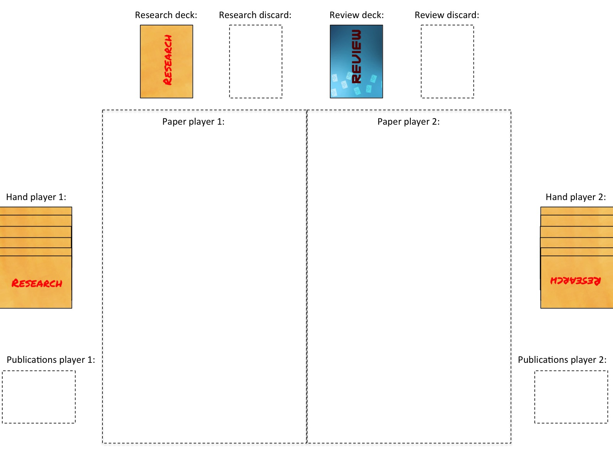
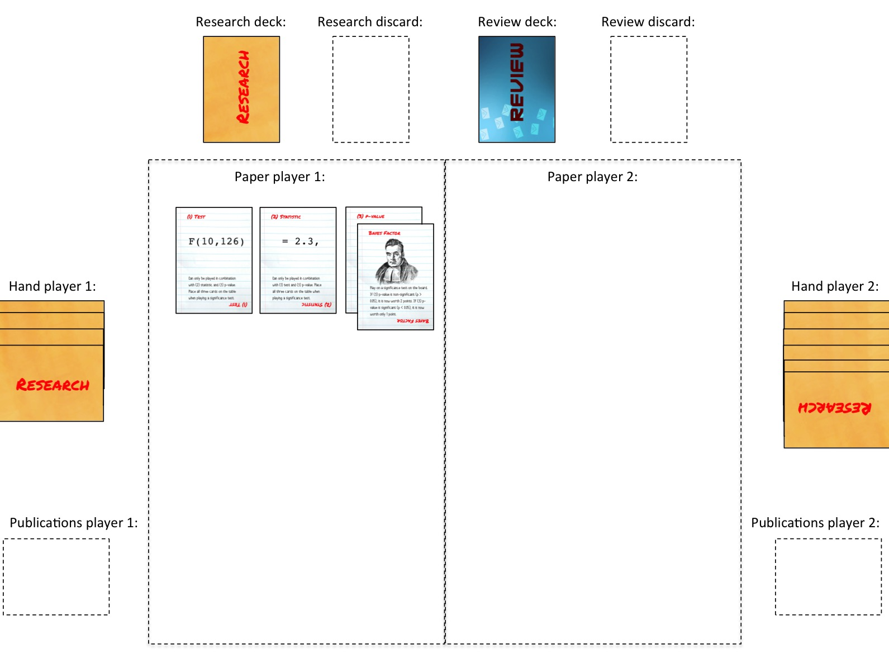
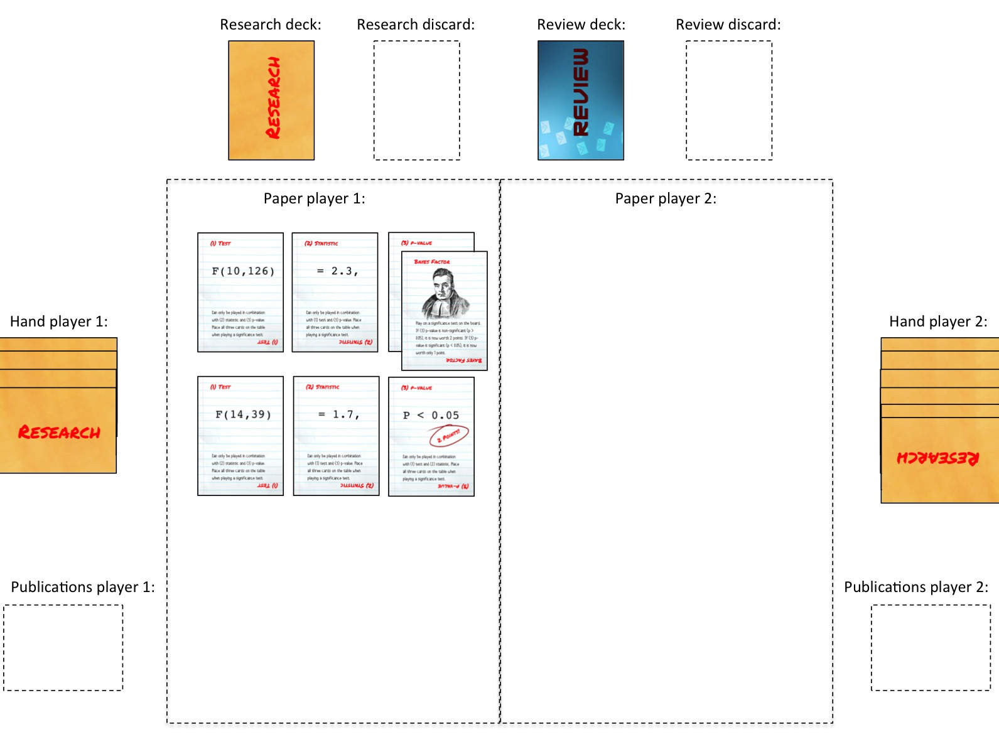
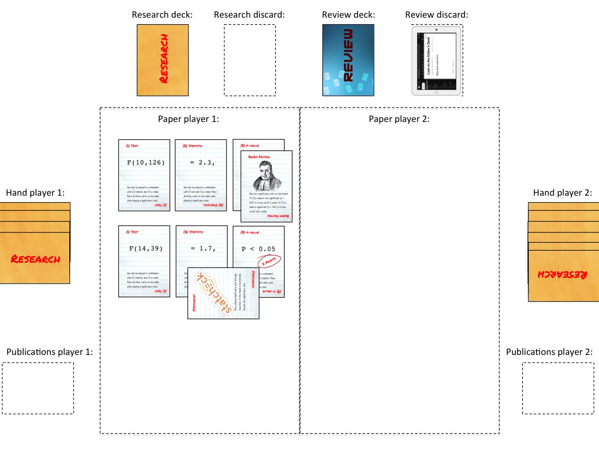
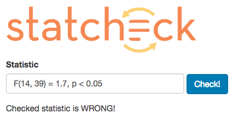
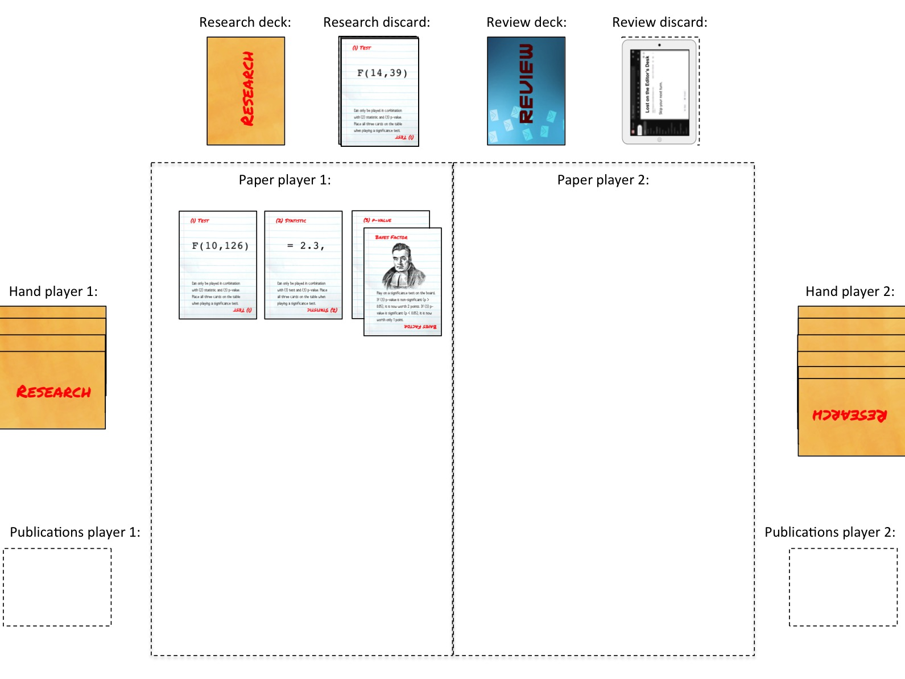

Made by [Sacha Epskamp](http://sachaepskamp.com/) and [Adela Isvoranu](http://www.adelaisvoranu.com/).

# Introduction

Publish or perish! In this game, you and your opponents will be working on papers to publish. Of course, significant statistics greatly increase your chance to publish, but beware of methodological terrorists checking your p-values or using Bayesian statistics against you! Luckily, questionable research practices or outright fraud might help you, as long as you are not caught by open science! As always, publication is mostly random and you have to be very lucky with the reviewers. The first player who publishes two papers (you have to replicate findings after all) wins!

# Requirements

## Game Pieces

The following game pieces are needed:

  - An 8-sided die (can be replaced with a 10-sided die for longer games)
  - 135 research cards, including:
    - 12 x *Statcheck!*
    - 6 x *Bayes Factor*
    - 4 x *Post-hoc theory*
    - 5 x *Behind the Pay-wall*
    - 9 x *60-Hour Work Week*
    - 6 x *Open Science*
    - 3 x *Fraudster*
    - 30 x *1. Test* (unique cards)
    - 30 x *2. Statistic* (unique cards)
    - 15 x *3. p-value* (p < 0.05)
    - 15 x *3. p-value* (p > 0.05)
  - 27 review cards, including:
    - 2 x *Reviewer 2!*
    - 5 x *Major Revisions*
    - 5 x *Minor revisions*
    - 5 x *Over the word limit*
    - 5 x *Lost on the editor's desk*
    - 5 x *Please cite this paper*

The section "print your own game" below explains how to print out your own game.

## Statcheck

[Statcheck](https://cran.r-project.org/web/packages/statcheck/index.html) is a program that checks reported statistical tests to be accurate, and is used in this game. To run statcheck, you either need to [install statcheck in R](https://mbnuijten.com/statcheck/) and use R:

```{r}
statcheck::statcheck("F(..., ...) = ..., p < 0.05", OneTailedTests = FALSE,pEqualAlphaSig = FALSE,OneTailedTxt = FALSE)
```
or (recommended) use the Statcheck: The Game web app at [sachaepskamp.shinyapps.io/statcheck/](https://sachaepskamp.shinyapps.io/statcheck/) (also usable on mobile devices)! Important rule: while playing Statcheck: The Game, you may **only** consult statcheck (or other programs / statistical textbooks / etcetera) when the *Statcheck!* card is played.

# Rules

## Game setup

To set up the game:

  - Shuffle the research and review decks and place them on the board
  - Reserve two areas for discarding research and review decks
  - Reserve an area for publications for each player
  - Give every player 6 cards
  
For example, for a two-player game the board would look like:



Each player rolls the die; the player who rolled the highest starts. In the case of a tie, the tied players roll again until the tie is broken.

## Turn order

Players take turns in clockwise order. You can do the following in your turn:

  - **Observation:** start your turn by drawing one card
  - **Induction:** You may discard two cards of the same type (e.g., two *Bayes Factor* or two  *3. p-value* cards) to draw one card. Cards of the type *1. Test*, *2. Statistic*, or *3. p-value* do not need to be identical in the exact value of the degrees of freedom, test statistic or significance
      - You can cycle cards this way as many times as you want per turn
  - **Deduction:** You may play any number of special cards (all research cards except *1. Test*, *2. Statistic*, and *3. p-value*)
  - **Testing:** You may play *one* statistical test on the board
      - These must consist of a *1. Test*, a *2. Statistic*, and a *3. p-value*
  - **Evaluation:** If you have more than 10 cards in your hand, discard cards until you have 10 cards. If you want you may attempt to publish your paper (see rules below).

As common in science, the induction, deduction and testing phases do not need to be played in order and can be repeated as many times as you want per turn. You may not play after attempting to publish, however. 


For example, player 1 may start her turn by drawing a card and playing a statistical test:


Her paper is now worth 2 points. Next, player 2 decides to play the card *Bayes Factor* on player 1's significance test:



Now, player 1's paper is only worth 1 point. 

## Publishing

At the end of your turn, you may try to *publish* your paper. To do so, roll the 8-sided die. 

  - If you roll lower or equal to the total number of points your paper is currently worth, you publish your paper! Place all cards from your board in a separate pile to indicate you have a publication. All cards are now out of the game (e.g., nobody can play *Statcheck!* on the publication), and you can start working on your second paper. If you publish your second paper, you win!
  - If you roll *higher* than the total number of points your paper is currently worth, draw a review card, read it out loud, resolve the card and end your turn

For example, player 1 plays another statistical test:



her paper is now worth 3 points and she takes a shot at publishing. She rolls a 6 and does not publish, and draws the reviewer card *Lost on the editor's desk*. Player 2 may play twice now.

# Cards

## Research deck

### 1. Test, 2. Statistic, and 3. p-value


The *1. Test*, *2. Statistic* and *3. p-value* cards are always played together, and represent adding a statistical test to your paper. Because of publication bias, statistically significant (p < 0.05) results are worth 2 points while non-significant results are only worth 1 point.

### Statcheck!


The *Statcheck!* game can be used to test someone's statistical test using statcheck. You can use the web-app at [sachaepskamp.shinyapps.io/statcheck/](https://sachaepskamp.shinyapps.io/statcheck/) for this purpose (mobile friendly). For example, player 2 decides to play statcheck on the second significance test played by player 1:



This result is not consistent:



And thus the statistical test is discarded:




### Bayes Factor


Bayesian statistics is a form of magic in which researchers can use "Bayes Factors" to make their own non-significant findings more interesting, or another's significant findings less interesting. This is reflected by the *Bayes Factor* card, which can be played on your own and your opponents significance tests. For more information on Bayesian statistics, see the [Bayesian Spectacles](https://www.bayesianspectacles.org/) blog!

## Post-hoc theory


Hypothesizing after results come in (are played on the board) is a valuable technique to make your paper more publishable. After all, you totally did expect that non-significant finding!


## 60-Hour Work Week


As is common in academia, not pulling some *60-hour work week*s will severely make you lag behind your opponents. When facing a strong deadline (e.g., your opponent is likely to win next turn), you may even need to work harder, at the risk of burning yourself out!

### Behind the Pay-wall


This card can be used to place *1. Test* and *2. Statistic* of a played statistical test face-down on the board. This way, you can get make life harder for those pesky methodological terrorists aiming to statcheck your work! Extra rule: you may also choose to play a statistical test from your hand, immediately placing *1. Test* and *2. Statistic* face-down.

### Fraudster


You can choose to cycle the *Fraudster* card (play it to draw a new card) at no cost. As long as you hold the Fraudster card, you are a **fraudster!** You can play the *Fraudster* card then immediately after you fail to publish and before drawing a review card to re-roll the publication die. Being a fraudster thus greatly improves your chances of publishing! Beware of *Open Science* though!


### Open Science


As in the real world, open science is the natural counter to a *Fraudster* and researchers working *Behind the Pay-wall*.

    
## Review deck

## Reviewer 2!


[The worst reviewer you can get!](https://www.facebook.com/groups/reviewer2/) Drawing this reviewer will cause you to completely start from scratch on your paper. 

## Major Revisions


Not the worst review, but you will need to put some substantive work in your paper to make it publishable. It will **not** get accepted in its current form!


## Minor revisions


The best review you can get! You can immediatly try to publish again!

## Over the word limit


Too long; did not read!


## Lost on the editor's desk


Just keep waiting for that e-mail. It is coming any moment now! Aaaaany moment!

## Please cite this paper


Because your peers really objectively think you should cite their work! This card acts as a separate statistical test that cannot be removed or statchecked. It is only removed when the player it is given to publishes his or her paper.
    
# Tips, tricks and frequently asked questions

  - Players are **NOT** allowed to consult statcheck, R, statistical textbooks or any source to see if a statistical test on the board is accurate, except when the *Statcheck!* card is played!
  - The game has only been validated in prior research up to 4 players!
  - As in academia, it might be smarter to try and publish smaller papers rather than to put all your results in one big paper
      - Beware though that trying to publish too soon is risky!
  - If you hold the *Fraudster* card, do not make an opponent play *Open Science* on you by playing a *Behind the Pay-wall* card...
  - You can cycle two cards of the same type (e.g., two *Bayes Factor* or two *2. Statistic* cards) to draw a new card. Do this often!
    
# Printing your own game

  - Buy a 8-sided die, or use `sample(1:8, 1)` in R to roll the die
  - Print the [Research deck](decks/researchDeck.pdf) single-paged with 9 pages on each paper (15 pages total). 
  - Print the [Research deck background](decks/researchBack.pdf) single-paged with 9 pages on each paper 15 times to the back of the research deck. 
    - Print the [Review deck](decks/reviewerDeck.pdf) single-paged with 9 pages on each paper (3 pages total). 
  - Print the [Review deck background](decks/reviewBack.pdf) single-paged with 9 pages on each paper 3 times to the back of the research deck. 
    
    
# Hardcore rules

  - Instead of rolling the die to decide starting player, the player with the largest h-index starts
  - When you play the *Statcheck!* card, also post a comment on Pubpeer
  - You can also play *Statcheck!* on published papers. If you detect an error, nothing happens except that you annoy your opponent a bit
  - When you are exposed as a fraudster, you also lose your PhD degree
  - If you draw the *Lost on the editor's desk* review card, skip your turn for the next three months
  - Any time you try to publish, do not roll (except if you play the fraudster card) but immediately draw a reviewer card. If you draw *Minor Revisions*, you may roll for publication.
  - PhD-game: play until one player has at least 4 publications
  - Cum-laude game: play until one player has at least 8 publications
  
  
  
